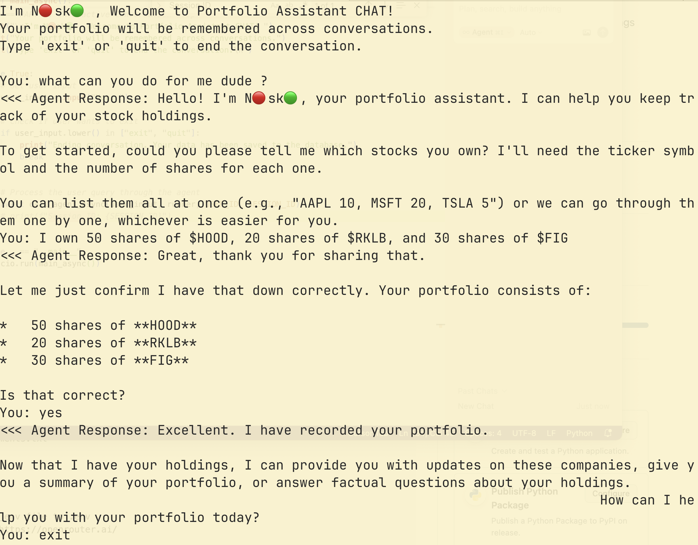
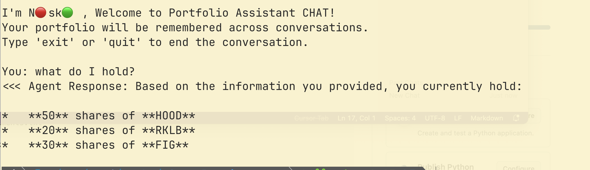

# **v2_apple_pie_agent** 
- Simple agent with a session database
- Integration with LiteLLM

## Holding example 
50 shares of $HOOD, 20 shares of $RKLB

## Example

Created session

Reloaded Session 

